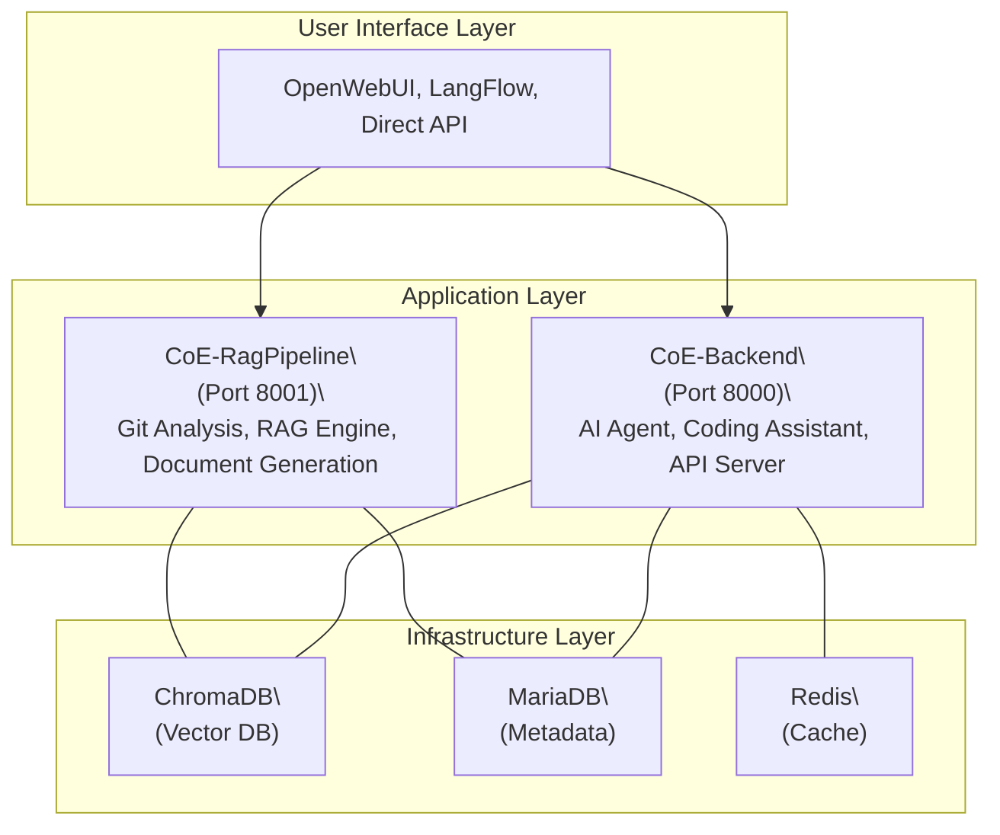

# 🤖 CoE: AI 기반 소프트웨어 개발 분석 및 자동화 플랫폼

**CoE for AI**는 Git 리포지토리를 심층 분석하고, AI를 활용하여 개발 가이드, 공통 코드, API 문서 등을 자동으로 생성하는 개발자 생산성 향상 플랫폼입니다.

이 프로젝트는 두 개의 핵심 마이크로서비스와 인프라 스택으로 구성됩니다:
1.  **`CoE-Backend`**: LangGraph 기반 AI 에이전트 및 API 서버
2.  **`CoE-RagPipeline`**: Git 분석 및 RAG 파이프라인 엔진
3.  **인프라**: ChromaDB, MariaDB, Redis

## ✨ 주요 기능

- **스마트 Git 분석**: 커밋 해시 기반 변경 감지로 불필요한 분석을 최소화합니다.
- **다중 언어 AST 분석**: Python, Java, JavaScript 등 주요 언어의 코드를 구조적으로 분석합니다.
- **LLM 기반 문서 자동 생성**: 분석 결과를 바탕으로 개발 가이드, API 명세서 등 7가지 유형의 문서를 자동으로 생성합니다.
- **AI 코딩 어시스턴트**: 코드 생성, 리팩토링, 리뷰, 테스트 작성을 지원합니다.
- **OpenWebUI 호환**: 표준 OpenAI API와 호환되어 다양한 UI와 연동할 수 있습니다.
- **완전한 Docker 지원**: `docker-compose` 명령 하나로 전체 시스템을 쉽게 실행하고 관리할 수 있습니다.


## 🏗️ 시스템 아키텍처

CoE 플랫폼은 마이크로서비스 아키텍처로 설계되어 각 서비스가 독립적으로 동작하면서 유기적으로 연동합니다.



## 🚀 시작하기

### 📋 사전 요구사항
- Docker 및 Docker Compose
- Git

### 1. 환경 변수 설정
각 서비스 디렉토리(`CoE-Backend`, `CoE-RagPipeline`)에 있는 `.env.sample` 파일을 `.env` 파일로 복사하고, 필요한 API 키를 설정합니다.

```bash
# CoE-Backend 설정
cp CoE-Backend/.env.sample CoE-Backend/.env

# CoE-RagPipeline 설정
cp CoE-RagPipeline/.env.sample CoE-RagPipeline/.env
```
`.env` 파일을 열어 `SKAX_API_KEY`와 `OPENAI_API_KEY`를 입력하세요.

### 2. 시스템 실행
프로젝트 루트 디렉토리에서 `run_all.sh` 스크립트를 사용하여 전체 시스템을 실행합니다.

```bash
# 실행 권한 부여
chmod +x run_all.sh

# 옵션과 함께 스크립트 실행
./run_all.sh [옵션]
```

**실행 옵션:**
- **`full`**: `docker-compose.yml`을 사용하여 모든 서비스를 Docker 컨테이너로 실행합니다. (배포 및 통합 테스트용)
- **`local`**: `docker-compose.local.yml`을 사용하여 데이터베이스 등 필수 인프라만 Docker로 실행합니다. (로컬 개발용)

**예시:**
```bash
# 모든 서비스를 Docker로 실행
./run_all.sh full

# 로컬 개발을 위해 인프라만 실행
./run_all.sh local
```

### 3. 시스템 중지
```bash
# 실행 중인 모든 CoE 관련 컨테이너를 중지하고 제거합니다.
./stop_all.sh
```

## 🏗️ 시스템 아키텍처

CoE 플랫폼은 각 서비스가 독립적으로 동작하고 확장할 수 있는 마이크로서비스 아키텍처를 따릅니다.

- **사용자 인터페이스**: OpenWebUI, LangFlow, 직접 API 호출 등
- **애플리케이션 레이어**: `CoE-Backend` (AI 에이전트), `CoE-RagPipeline` (분석 엔진)
- **인프라 레이어**: ChromaDB (벡터 DB), MariaDB (관계형 DB), Redis (캐시)

## 📂 프로젝트 구조

```
CoE/
├── CoE-Backend/        # AI 에이전트 및 API 서버
├── CoE-RagPipeline/    # Git 분석 및 RAG 파이프라인
├── db/                 # 데이터베이스 스키마 및 초기 데이터
├── docs/               # 프로젝트 관련 문서
├── run_all.sh          # 통합 실행 스크립트
├── stop_all.sh         # 통합 중지 스크립트
├── docker-compose.yml      # 전체 Docker 환경 설정
├── docker-compose.local.yml # 로컬 개발용 인프라 설정
└── README.md           # 현재 파일
```

## 📚 API 문서 및 사용 예시

각 서비스의 API는 Swagger UI를 통해 확인하고 테스트할 수 있습니다.

- **CoE-Backend API**: `http://localhost:8000/docs`
- **CoE-RagPipeline API**: `http://localhost:8001/docs`

자세한 사용 예시와 각 서비스의 기능은 아래 README 문서를 참고하세요.
- **[CoE-Backend README](CoE-Backend/README.md)**
- **[CoE-RagPipeline README](CoE-RagPipeline/README.md)**
