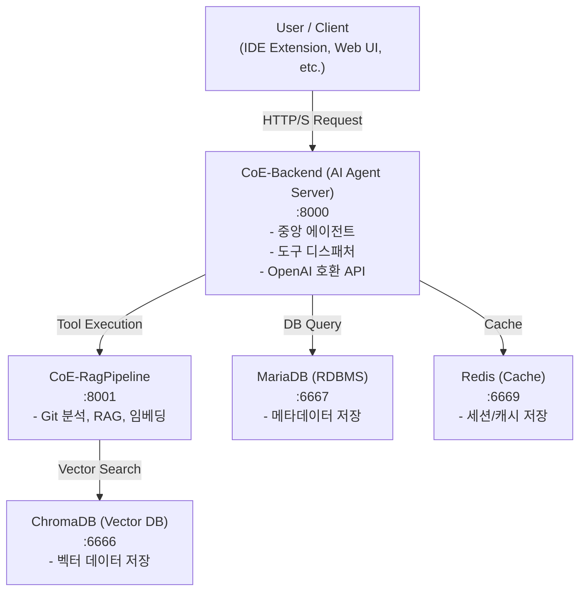
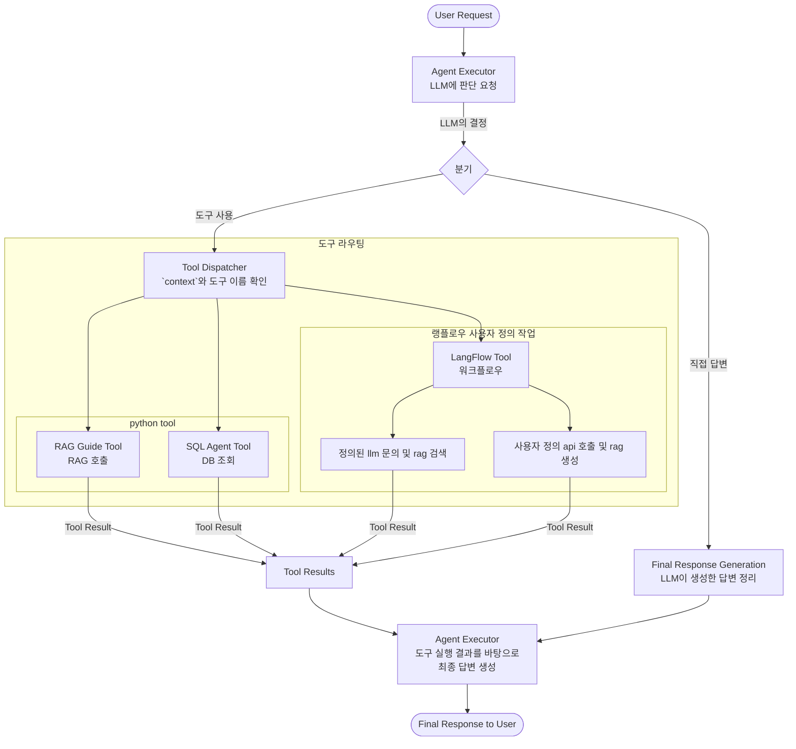

# CoE (Center of Excellence) AI Platform

문서 맵
- 배포/기동: `docs/DEPLOY.md` (통합 compose 사용 권장)
- 마이그레이션 운영: `docs/OPERATIONS.md`
- Swagger UI 경로/사용: `docs/SWAGGER_GUIDE.md`
- cURL 예시 모음: `docs/curl-checks.md`

참고: 상세 배포/예시 내용은 위 문서로 모아 중복을 줄였습니다. README는 개요/아키텍처 중심으로 유지합니다.

## 1. 프로젝트 개요

CoE AI 플랫폼은 AI 기반의 개발 생산성 향상 및 코드 분석을 위한 통합 솔루션입니다.

이 시스템은 중앙 AI 에이전트를 통해 사용자의 자연어 요청을 이해하고, RAG(Retrieval-Augmented Generation) 파이프라인과 연동하여 코드 저장소를 분석하거나, 데이터베이스에 직접 질문하는 등 다양한 작업을 자율적으로 수행합니다. 개발자는 이 플랫폼을 통해 기술 문서 자동 생성, 코드 분석, 개발 가이드 검색 등 복잡한 작업을 손쉽게 처리할 수 있습니다.

## 2. 시스템 아키텍처

전체 시스템은 Docker Compose를 통해 관리되는 마이크로서비스 아키텍처로 구성되어 있습니다. 각 서비스는 명확한 역할을 가지며, 중앙 `CoE-Backend`를 통해 유기적으로 연동됩니다.



## 3. 핵심 컴포넌트 설명

-   **`CoE-Backend`**: 이 시스템의 두뇌입니다. 사용자의 요청을 받아 어떤 작업을 수행할지 결정하고, 필요한 도구를 실행하여 다른 서비스들을 조율하는 중앙 AI 에이전트입니다.
-   **`CoE-RagPipeline`**: 데이터 처리 및 RAG를 전담하는 서비스입니다. Git 리포지토리를 분석하고, 코드를 임베딩하며, 벡터 데이터베이스를 관리하고, 기술 문서를 생성하는 등 무거운 작업을 처리합니다.
-   **`MariaDB`**: 관계형 데이터베이스입니다. 사용자 정보, Git 분석 결과 메타데이터 등 정형 데이터를 저장합니다.
-   **`ChromaDB`**: 벡터 데이터베이스입니다. 코드, 문서 등이 임베딩된 벡터 데이터를 저장하고, 유사도 검색을 통해 RAG의 핵심인 '검색(Retrieval)' 기능을 수행합니다.
-   **`Redis`**: 인메모리 데이터 저장소로, 빠른 속도가 필요한 캐시나 세션 정보 등을 관리합니다.

## 4. 주요 워크플로우

### 4.1. `CoE-Backend` 내부 처리 흐름 (상세)

사용자 요청이 `CoE-Backend`에 도달했을 때, 내부 에이전트는 다음과 같은 흐름과 분기 처리를 통해 응답을 생성합니다.



-   **흐름**: 모든 요청은 `Agent Executor`에서 시작됩니다. LLM은 요청을 분석하여 직접 답변할지, 도구를 사용할지 결정합니다.
-   **분기처리**: 도구 사용이 결정되면, `Tool Dispatcher`가 요청의 `context`와 LLM이 선택한 도구 이름을 바탕으로 가장 적합한 도구(RAG, SQL 등)로 작업을 분기하여 실행시킵니다.

### 4.2. Git 리포지토리 분석 워크플로우

1.  **사용자**: "https://.../my-repo.git 분석해줘" (`CoE-Backend`에 요청)
2.  **CoE-Backend**: `rag_guide_tool` 실행을 결정하고 `CoE-RagPipeline`에 작업 위임.
3.  **CoE-RagPipeline**: Git 리포지토리를 클론하고 코드 분석 및 임베딩 수행.
4.  **DB 저장**: 분석 결과(메타데이터)는 `MariaDB`에, 임베딩된 벡터는 `ChromaDB`에 저장.
5.  **응답**: 분석이 완료되었음을 사용자에게 알림.

## 5. 전체 시스템 시작하기

### 사전 요구사항

-   Docker
-   Docker Compose
-   Git (리포지토리 분석 시)

### 실행 방법

1.  **프로젝트 클론 및 디렉토리 이동**:
    ```bash
    git clone <repository_url>
    cd CoE
    ```

2.  **환경 변수 설정**:
    -   `CoE-Backend/.env`
    -   `CoE-RagPipeline/.env`
    -   위 두 파일에 필요한 API 키 및 DB 접속 정보 등을 `.env.sample`을 참고하여 기입합니다.

3.  **Docker Compose 실행**:
    ```bash
    # 모든 서비스 빌드 및 백그라운드 실행
    docker compose up --build -d
    ```

4.  **서비스 중지**:
    ```bash
    docker compose down
    ```

5.  **로그 확인**:
    ```bash
    # 전체 로그 확인
    docker compose logs -f

    # 특정 서비스 로그 확인
    docker compose logs -f coe-backend
    ```

## 6. 운영/마이그레이션 가이드

- 기본적으로 DB 마이그레이션은 스킵됩니다. 운영 배포 시에만 활성화하여 적용하세요.
- 자세한 운영 절차와 옵션은 `docs/OPERATIONS.md`를 참고하세요.

## 7. ITSD 담당자 추천 에이전트 통합

- RAG 파이프라인:
  - `POST /api/v1/itsd/embed-requests` — ITSD Excel(.xlsx) 임베딩
  - `POST /api/v1/itsd/recommend-assignee` — 제목/내용 기반 담당자 추천 (Markdown 반환)
- 백엔드(프록시):
  - `POST /itsd/embed-requests` — RAG 프록시 업로드
  - `POST /itsd/recommend-assignee` — RAG 프록시 추천
- 백엔드 에이전트 도구:
  - 도구명: `itsd_recommend_assignee`
  - 컨텍스트: `openWebUi`
  - 설명: 제목/내용을 입력받아 추천 결과(Markdown)를 생성
