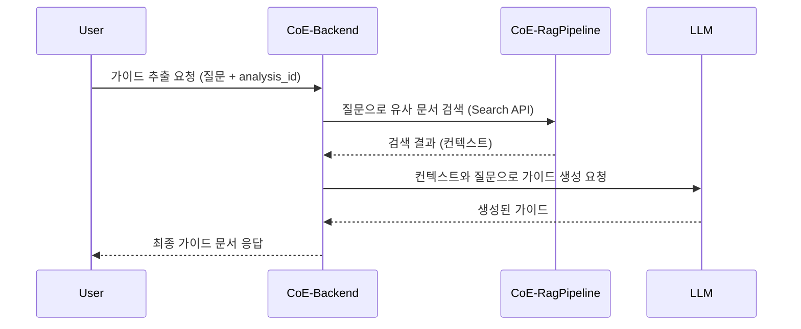

# 🔍 가이드 추출 도구 (Guide Extraction Tool)

Git 레포지토리 분석 결과를 바탕으로 **표준개발가이드**, **공통코드화**, **공통함수 가이드**를 자동으로 추출하는 LLM 기반 도구입니다.

## ✨ 주요 기능

- **자동 가이드 추출**: CoE-RagPipeline의 분석 결과를 활용하여 개발 가이드를 자동 생성
- **3가지 가이드 제공**:
  - 표준개발가이드: 코딩 스타일, 네이밍 컨벤션, 프로젝트 구조, 아키텍처 패턴
  - 공통코드화: 중복 코드 패턴, 재사용 가능한 컴포넌트, 공통 모듈화 방안
  - 공통함수 가이드: 자주 사용되는 함수 패턴, 유틸리티 함수, 헬퍼 함수
- **LLM 기반 분석**: 실제 코드 구조와 패턴을 분석하여 구체적이고 실용적인 가이드 생성
- **모듈형 아키텍처**: CoE-Backend의 도구 레지스트리 패턴을 활용한 플러그인 방식

## 🏗️ 아키텍처



## 🚀 사용법

### 1. 사전 준비

두 개의 서버가 모두 실행되어야 합니다:

```bash
# 터미널 1: RAG Pipeline 서버 실행
cd CoE-RagPipeline
source .venv/bin/activate
python main.py

# 터미널 2: Backend 서버 실행  
cd CoE-Backend
source .venv/bin/activate
python main.py
```

### 2. Git 레포지토리 분석

먼저 CoE-RagPipeline에서 분석할 Git 레포지토리를 등록하고 분석을 수행합니다:

```bash
# 분석 시작
curl -X POST "http://127.0.0.1:8001/analyze" \
  -H "Content-Type: application/json" \
  -d '{
    "repositories": [
      {
        "url": "https://github.com/your-org/your-repo.git",
        "branch": "main"
      }
    ],
    "include_ast": true,
    "include_tech_spec": true,
    "include_correlation": false
  }'

# 분석 결과 확인
curl -X GET "http://127.0.0.1:8001/results"
```

### 3. 가이드 추출

#### 방법 1: 클라이언트 사용

```bash
cd CoE-Backend
python client.py
```

채팅에서 다음과 같이 입력:
```
analysis_id [분석ID]로 개발 가이드를 추출해줘
```

#### 방법 2: API 직접 호출

```bash
curl -X POST "http://127.0.0.1:8000/chat" \
  -H "Content-Type: application/json" \
  -d '{
    "messages": [
      {
        "role": "user",
        "content": "analysis_id [분석ID]로 개발 가이드를 추출해줘"
      }
    ]
  }'
```

#### 방법 3: 데모 스크립트 사용

```bash
cd CoE-Backend
python demo_guide_extraction.py
```

## 📋 추출되는 가이드 예시

### 표준개발가이드
- **코딩 스타일**: 들여쓰기, 변수명 규칙, 주석 스타일
- **네이밍 컨벤션**: 클래스명, 함수명, 변수명 규칙
- **프로젝트 구조**: 디렉토리 구조, 파일 조직 방법
- **아키텍처 패턴**: 사용된 디자인 패턴, 모듈 구조

### 공통코드화 가이드
- **중복 코드 패턴**: 반복되는 코드 블록 식별
- **재사용 가능한 컴포넌트**: 공통 모듈로 분리 가능한 코드
- **공통 모듈화 방안**: 라이브러리화, 유틸리티 분리 방법

### 공통함수 가이드
- **자주 사용되는 함수 패턴**: 반복적으로 나타나는 함수 구조
- **유틸리티 함수**: 범용적으로 사용 가능한 헬퍼 함수
- **헬퍼 함수**: 특정 도메인에서 자주 사용되는 보조 함수

## 🔧 구현 세부사항

### 파일 구조

```
CoE-Backend/tools/
├── guide_extraction_tool.py    # 메인 가이드 추출 도구
├── test_guide_tool.py          # 단위 테스트
├── test_integration.py         # 통합 테스트
└── demo_guide_extraction.py    # 데모 스크립트
```

### 핵심 함수

- `guide_extraction_node()`: 메인 가이드 추출 로직
- `get_rag_analysis_result()`: RAG Pipeline에서 분석 결과 조회
- `extract_git_urls_from_analysis()`: 분석 결과에서 Git URL 추출

### LLM 프롬프트

도구는 구조화된 프롬프트를 사용하여 LLM에게 다음을 요청합니다:
1. 분석 결과에서 코드 패턴 식별
2. 아키텍처 구조 분석
3. 베스트 프랙티스 추출
4. 3가지 가이드로 구조화된 결과 생성

## 🧪 테스트

### 단위 테스트
```bash
cd CoE-Backend
python test_guide_tool.py
```

### 통합 테스트
```bash
cd CoE-Backend
python test_integration.py
```

### 데모 실행
```bash
cd CoE-Backend
python demo_guide_extraction.py
```

## 🔍 문제 해결

### 일반적인 오류

1. **"분석 결과를 찾을 수 없습니다"**
   - CoE-RagPipeline 서버가 실행 중인지 확인
   - 분석이 완료된 결과가 있는지 확인

2. **"RAG Pipeline 연결 오류"**
   - 포트 8001에서 RAG Pipeline 서버 실행 확인
   - 네트워크 연결 상태 확인

3. **"LLM 응답 오류"**
   - .env 파일의 API 키 설정 확인
   - LLM 서비스 상태 확인

### 디버깅

로그 확인:
```bash
# Backend 서버 로그
cd CoE-Backend && python main.py

# RAG Pipeline 서버 로그  
cd CoE-RagPipeline && python main.py
```

## 🚀 확장 가능성

이 도구는 CoE-Backend의 모듈형 아키텍처를 활용하므로 쉽게 확장할 수 있습니다:

- **새로운 가이드 타입 추가**: 프롬프트 수정으로 추가 가이드 생성
- **다른 분석 도구 연동**: 다른 코드 분석 도구의 결과 활용
- **출력 형식 다양화**: JSON, PDF, HTML 등 다양한 형식으로 출력
- **언어별 특화**: 특정 프로그래밍 언어에 특화된 가이드 생성

## 📚 관련 문서

- [CoE-Backend README](CoE-Backend/README.md)
- [CoE-RagPipeline README](CoE-RagPipeline/README.md)
- [도구 개발 가이드](CoE-Backend/tools/README.md)