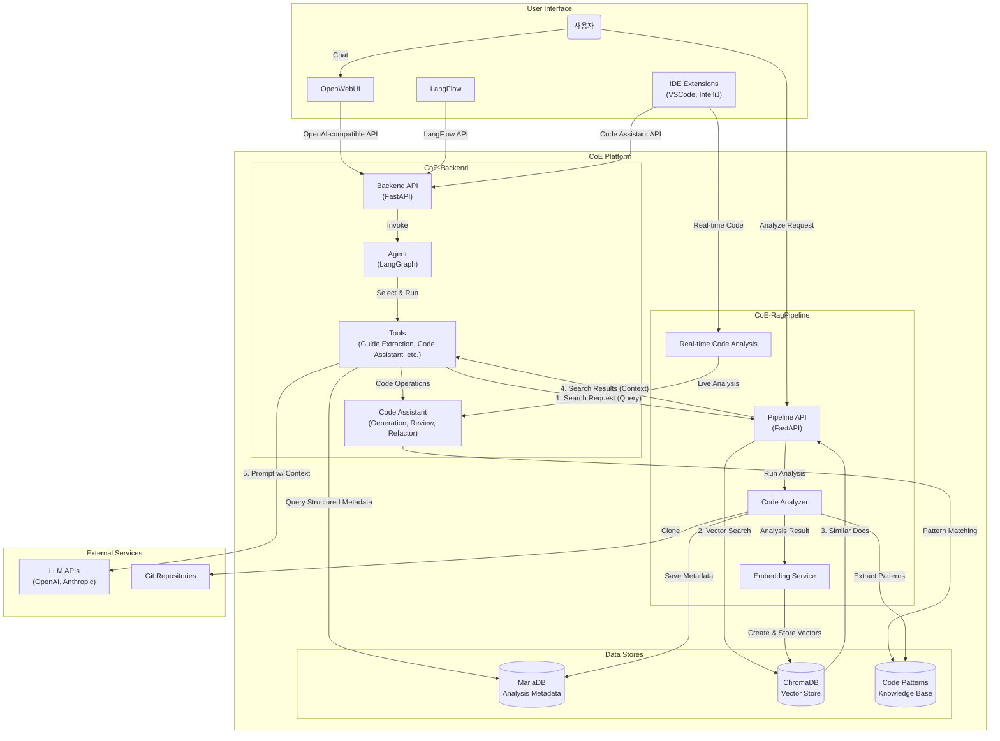
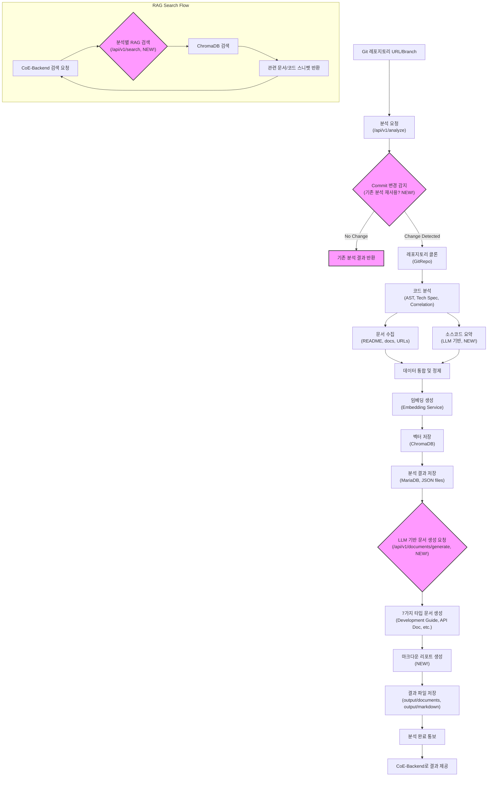
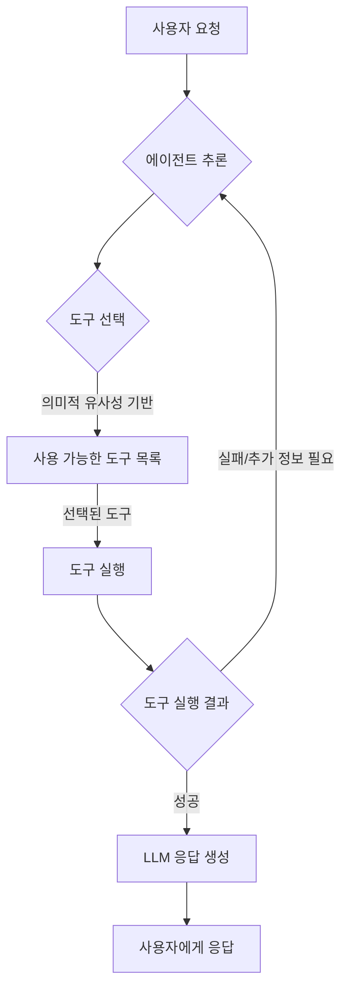
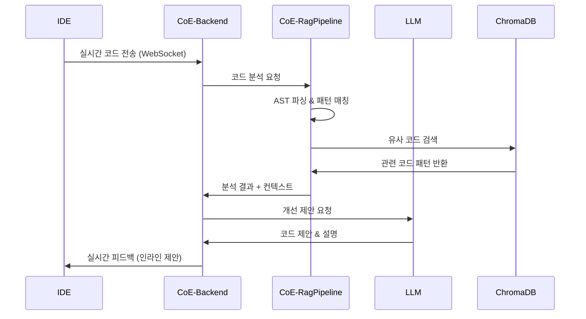

# 🤖 CoE 플랫폼 통합 설계 문서

## 1. 개요

본 문서는 **CoE for AI** 플랫폼의 전체 아키텍처와 구성 요소 간의 상호작용을 정의합니다. 이 플랫폼은 Git 레포지토리 분석을 자동화하고, 그 결과를 바탕으로 AI 기반 개발 가이드를 생성하여 개발 생산성과 코드 품질을 향상시키는 것을 목표로 합니다.

**기본적으로 파일별로 역활은 철저히 분리한다.**

**핵심 특징**:
- **지능형 코드 어시스턴트**: 실시간 코드 분석, 자동 완성, 리팩토링 제안, 버그 탐지 등 포괄적인 개발 지원
- **RAG 기반 컨텍스트 인식**: 프로젝트 전체 코드베이스를 이해하고 컨텍스트에 맞는 제안 제공
- **IDE 네이티브 통합**: VSCode, IntelliJ 등 주요 IDE와의 완벽한 통합으로 개발 워크플로우 최적화

플랫폼은 다음 두 개의 핵심 마이크로서비스로 구성됩니다:
- **`CoE-RagPipeline`**: 소스 코드 분석, 데이터 처리, 실시간 코드 분석 및 임베딩을 담당하는 **데이터 파이프라인**.
- **`CoE-Backend`**: LLM 기반 추론, 코드 어시스턴트 기능, 외부 인터페이스(OpenWebUI, LangFlow, IDE) 연동 및 API 제공을 담당하는 **AI 에이전트**.

## 2. 시스템 아키텍처

## 3. 핵심 컴포넌트 설계

### 3.1. CoE-RagPipeline (데이터 생산/처리 계층)
- **역할**: Git 레포지토리의 정적 분석 및 RAG 데이터 생성
- **주요 기능**:
  - **다중 레포지토리 분석**: Git 소스 코드 클론 및 병렬 분석 관리
  - **AST 및 기술스펙 분석**: AST, 기술 스택, 코드 메트릭, 의존성 그래프 등 정적 분석 수행
  - **레포지토리간 연관관계 추출**: 공통 의존성, 코드 패턴, API 호출 관계, 개발자 협업 네트워크 분석
  - **분석 결과 저장**: 분석 결과를 구조화된 데이터(JSON)로 변환 후 MariaDB에 저장
  - **LLM 기반 가이드 생성**: 분석 결과와 관련 문서 URL을 제공받아 표준개발가이드 문서, 공통코드, 재활용 및 공통함수를 Markdown 파일로 정리
  - **지능형 청킹 및 임베딩**: 정리한 Markdown 파일을 의미 단위로 청킹하고 벡터로 임베딩하여 ChromaDB에 저장
  - **실시간 코드 분석**: IDE에서 전송되는 코드를 실시간으로 분석하여 즉시 피드백 제공
  - **코드 패턴 추출**: 반복되는 코드 패턴, 디자인 패턴, 안티패턴을 자동으로 식별하고 학습

### 3.1.1. RAG Pipeline 흐름

CoE-RagPipeline은 Git 레포지토리 분석부터 LLM 기반 문서 생성까지의 전체 데이터 처리 흐름을 담당합니다.

- **API**: `/api/v1/analyze`, `/api/v1/results`, `/api/v1/search`, `/api/v1/stats`, `/api/v1/generate/guide`, `/api/v1/realtime/analyze`, `/patterns/extract`

### 3.2. CoE-Backend (AI 에이전트/API 계층)
- **역할**: AI 추론 및 외부 인터페이스 제공
- **주요 기능**:
  - **JWT 기반 사용자 관리**: FastAPI-Users를 활용한 안전한 사용자 인증 및 세션 관리
  - **3턴 멀티턴 대화**: 사용자별 대화 세션 관리 및 자동 요약 기능
  - **SKAX 모델 기반 LangGraph 에이전트**: sk aodt llm을 사용한 동적 에이전트 실행
  - **지능형 도구 선택**: 의미적 유사성 기반으로 `guide_extraction_tool`, `code_assistant_tool` 등 적절한 도구 선택 및 실행

### 3.2.1. LangGraph 툴 선택 흐름

LangGraph 에이전트는 사용자 요청과 현재 대화 상태를 기반으로 가장 적절한 도구를 동적으로 선택하고 실행합니다.

  - **RAG 컨텍스트 통합**: `CoE-RagPipeline`의 검색 API를 호출하여 RAG 컨텍스트 확보
  - **LLM 추론 및 응답 생성**: 확보된 컨텍스트를 바탕으로 LLM에 프롬프트 전달 및 결과 생성
  - **대화 히스토리 관리**: 채팅 메시지 저장 및 요약된 대화 저장
  - **권한 기반 접근 제어**: 역할별 권한 관리 (admin, user, developer)
  - **외부 시스템 연동**: OpenWebUI, LangFlow 등과 호환되는 OpenAI 표준 API 제공 (LangFlow 연동 API 포함)
  - **코드 어시스턴트 기능**: 10개 언어 지원 코드 생성, 리팩토링, 버그 수정, 코드 리뷰 등 개발 지원
- **API**: `/v1/chat/completions`, `/v1/models`, `/v1/embeddings`, `/flows/*`, `/api/coding-assistant/*`, `/auth/*`, `/vector/*`

### 3.3. 코드 어시스턴트 (Code Assistant) 모듈
- **역할**: AI 기반 실시간 개발 지원 및 코드 품질 향상
- **주요 기능**:
  - **코드 생성**: 자연어 설명을 바탕으로 코드 자동 생성
  - **코드 완성**: 컨텍스트 기반 지능형 코드 자동완성
  - **리팩토링 제안**: 코드 품질 개선을 위한 리팩토링 방안 제시
  - **버그 탐지 및 수정**: 정적 분석과 AI를 결합한 버그 탐지 및 수정 제안
  - **코드 리뷰**: 자동화된 코드 리뷰 및 개선 사항 제안
  - **테스트 코드 생성**: 단위 테스트, 통합 테스트 코드 자동 생성
  - **문서화**: 코드 주석, API 문서, README 자동 생성
  - **성능 최적화**: 성능 병목 지점 식별 및 최적화 방안 제시

## 4. 코드 어시스턴트 상세 설계

### 4.1. 실시간 코드 분석 및 피드백 시스템

#### 4.1.1. 실시간 분석 파이프라인

#### 4.1.2. 지원 기능
- **실시간 코드 품질 검사**: 타이핑과 동시에 코드 품질 메트릭 계산
- **즉시 리팩토링 제안**: 코드 스멜 감지 시 즉시 개선 방안 제시
- **컨텍스트 기반 자동완성**: 프로젝트 전체 코드베이스를 고려한 지능형 자동완성
- **실시간 버그 탐지**: 정적 분석과 AI를 결합한 실시간 버그 감지

### 4.2. IDE 통합 아키텍처

#### 4.2.1. 지원 IDE 및 확장 프로그램
- **Visual Studio Code**: CoE Extension
- **IntelliJ IDEA**: CoE Plugin
- **Vim/Neovim**: Language Server Protocol (LSP) 지원
- **Sublime Text**: CoE Package

#### 4.2.2. 통신 프로토콜
- **WebSocket**: 실시간 양방향 통신
- **Language Server Protocol (LSP)**: 표준 IDE 통합
- **REST API**: 배치 작업 및 설정 관리

### 4.3. 코드 생성 및 완성 시스템

#### 4.3.1. 코드 생성 워크플로우

#### 4.3.2. 지원 기능
- **함수/클래스 생성**: 자연어 설명으로부터 완전한 함수/클래스 생성
- **테스트 코드 자동 생성**: 기존 코드 분석을 통한 단위 테스트 생성
- **API 클라이언트 생성**: OpenAPI 스펙으로부터 클라이언트 코드 자동 생성
- **데이터베이스 스키마 생성**: 요구사항으로부터 DB 스키마 및 ORM 모델 생성

### 4.4. 코드 리뷰 및 품질 관리

#### 4.4.1. 자동 코드 리뷰 프로세스
- **정적 분석**: 코드 복잡도, 중복도, 보안 취약점 분석
- **패턴 매칭**: 프로젝트 내 기존 패턴과의 일관성 검사
- **베스트 프랙티스 검증**: 언어별/프레임워크별 모범 사례 준수 여부 확인
- **성능 분석**: 잠재적 성능 병목 지점 식별

#### 4.4.2. 리뷰 결과 제공
- **인라인 코멘트**: 코드 라인별 구체적인 개선 제안
- **전체 요약**: 코드 품질 점수 및 주요 이슈 요약
- **개선 우선순위**: 수정이 필요한 항목의 우선순위 제시
- **학습 자료 링크**: 관련 문서 및 예제 코드 링크 제공

## 5. 코드 어시스턴트 API 명세

### 5.1. 실시간 분석 API
- **`POST /code/analyze/realtime`**: 실시간 코드 분석 및 피드백
- **`WebSocket /code/stream`**: 실시간 코드 스트리밍 및 양방향 통신
- **`GET /code/suggestions/{session_id}`**: 세션별 제안 사항 조회

### 5.2. 코드 생성 API
- **`POST /code/generate`**: 자연어 요청으로부터 코드 생성
- **`POST /code/complete`**: 컨텍스트 기반 코드 자동완성
- **`POST /code/refactor`**: 코드 리팩토링 제안 및 적용
- **`POST /code/test/generate`**: 테스트 코드 자동 생성

### 5.3. 코드 리뷰 API
- **`POST /code/review`**: 코드 리뷰 수행 및 결과 반환
- **`GET /code/metrics/{file_path}`**: 코드 품질 메트릭 조회
- **`POST /code/fix`**: 자동 버그 수정 제안
- **`GET /code/patterns/violations`**: 코딩 패턴 위반 사항 조회

### 5.4. 문서화 API
- **`POST /code/document`**: 코드 주석 및 문서 자동 생성
- **`POST /code/readme/generate`**: README 파일 자동 생성
- **`POST /code/api/document`**: API 문서 자동 생성

## 6. 추가 고려사항

### 6.1. 데이터 스키마 및 API 명세
- **정의**: 두 서비스 간의 모든 API 요청/응답 및 DB 저장 데이터는 Pydantic 모델을 통해 **공유 스키마**로 관리한다.
- **목표**: 데이터 정합성을 보장하고, 스키마 변경 시 영향을 받는 범위를 명확히 하여 시스템 안정성을 높인다.

### 6.2. 비동기 워크플로우 관리
- **정의**: `CoE-RagPipeline`의 분석 작업은 **웹훅(Webhook)** 또는 **메시지 큐**를 통해 완료 상태를 `CoE-Backend`에 통지하는 방식을 고려한다.
- **목표**: 비효율적인 폴링(Polling) 방식을 개선하여 시스템 부하를 줄이고 응답성을 향상시킨다.

### 6.3. 보안
- **Git 접근**: Private 레포지토리 접근을 위한 Git 토큰/SSH 키는 **시크릿 관리 시스템**을 통해 안전하게 관리한다.
- **서비스 간 인증**: 내부 서비스 간 통신에도 **API 키 인증**을 도입하여 비인가 접근을 차단한다.
- **코드 보안**: 전송되는 코드 데이터는 **암호화**하여 보안을 강화한다.

### 6.4. 사용자 피드백 루프
- **정의**: `CoE-Backend`가 생성한 가이드 및 코드 제안에 대해 사용자가 **평가(좋아요/싫어요) 및 코멘트**를 남길 수 있는 기능을 API에 추가한다.
- **목표**: 수집된 피드백을 통해 LLM 프롬프트를 지속적으로 개선하고, RAG 시스템의 정확도를 높인다.
- **코드 어시스턴트 학습**: 사용자의 코드 수정 패턴을 학습하여 제안 품질을 지속적으로 개선한다.

### 6.5. 데이터 생명주기 관리
- **정의**: 동일 레포지토리 재분석 시 **버전 관리** 정책을 수립하고, 오래된 데이터는 주기적으로 **아카이빙 또는 삭제**하는 정책을 수립한다.
- **목표**: 스토리지 비용을 최적화하고, 검색 성능을 유지한다.
- **코드 패턴 진화**: 시간에 따른 코드 패턴 변화를 추적하여 최신 트렌드를 반영한다.

### 6.6. 성능 최적화
- **캐싱 전략**: 자주 요청되는 코드 분석 결과 및 제안 사항을 캐싱하여 응답 속도 향상
- **배치 처리**: 대용량 코드베이스 분석 시 배치 처리를 통한 효율성 증대
- **점진적 분석**: 코드 변경 사항만을 대상으로 하는 점진적 분석으로 리소스 절약

### 6.7. 확장성 및 플러그인 아키텍처
- **언어 지원 확장**: 새로운 프로그래밍 언어 지원을 위한 플러그인 시스템
- **커스텀 규칙**: 팀별/프로젝트별 커스텀 코딩 규칙 및 패턴 정의 기능
- **써드파티 통합**: GitHub, GitLab, Jira 등 외부 도구와의 연동 지원