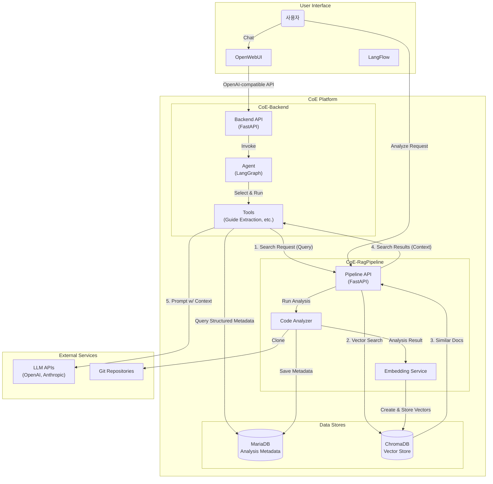

# 🤖 CoE 플랫폼 통합 설계 문서

## 1. 개요

본 문서는 **CoE(Center of Excellence) for AI** 플랫폼의 전체 아키텍처와 구성 요소 간의 상호작용을 정의합니다. 이 플랫폼은 Git 레포지토리 분석을 자동화하고, 그 결과를 바탕으로 AI 기반 개발 가이드를 생성하여 개발 생산성과 코드 품질을 향상시키는 것을 목표로 합니다.

플랫폼은 다음 두 개의 핵심 마이크로서비스로 구성됩니다:
- **`CoE-RagPipeline`**: 소스 코드 분석, 데이터 처리 및 임베딩을 담당하는 **데이터 파이프라인**.
- **`CoE-Backend`**: LLM 기반 추론, 외부 인터페이스(OpenWebUI, LangFlow) 연동 및 API 제공을 담당하는 **AI 에이전트**.

## 2. 시스템 아키텍처

## 3. 핵심 컴포넌트 설계

### 3.1. CoE-RagPipeline (데이터 생산/처리 계층)
- **역할**: Git 레포지토리의 정적 분석 및 RAG 데이터 생성
- **주요 기능**:
  - Git 소스 코드 클론 및 관리
  - AST, 기술 스택, 코드 메트릭 등 정적 분석 수행
  - 분석 결과를 구조화된 데이터(JSON)로 변환 후 MariaDB에 저장
  - 텍스트 데이터(코드, 문서)를 청킹하고 벡터로 임베딩하여 ChromaDB에 저장
- **API**: `/analyze`, `/results`, `/search`, `/embeddings/stats`

### 3.2. CoE-Backend (AI 에이전트/API 계층)
- **역할**: AI 추론 및 외부 인터페이스 제공
- **주요 기능**:
  - LangGraph 기반의 동적 에이전트 실행
  - 사용자의 요청에 따라 `guide_extraction_tool` 등 적절한 도구 선택 및 실행
  - `CoE-RagPipeline`의 검색 API를 호출하여 RAG 컨텍스트 확보
  - 확보된 컨텍스트를 바탕으로 LLM에 프롬프트 전달 및 결과 생성
  - OpenWebUI, LangFlow 등과 호환되는 OpenAI 표준 API 제공
- **API**: `/v1/chat/completions`, `/v1/models`, `/flows/*`

## 4. 추가 고려사항

### 4.1. 데이터 스키마 및 API 명세
- **정의**: 두 서비스 간의 모든 API 요청/응답 및 DB 저장 데이터는 Pydantic 모델을 통해 **공유 스키마**로 관리한다.
- **목표**: 데이터 정합성을 보장하고, 스키마 변경 시 영향을 받는 범위를 명확히 하여 시스템 안정성을 높인다.

### 4.2. 비동기 워크플로우 관리
- **정의**: `CoE-RagPipeline`의 분석 작업은 **웹훅(Webhook)** 또는 **메시지 큐**를 통해 완료 상태를 `CoE-Backend`에 통지하는 방식을 고려한다.
- **목표**: 비효율적인 폴링(Polling) 방식을 개선하여 시스템 부하를 줄이고 응답성을 향상시킨다.

### 4.3. 보안
- **Git 접근**: Private 레포지토리 접근을 위한 Git 토큰/SSH 키는 **시크릿 관리 시스템**을 통해 안전하게 관리한다.
- **서비스 간 인증**: 내부 서비스 간 통신에도 **API 키 인증**을 도입하여 비인가 접근을 차단한다.

### 4.4. 사용자 피드백 루프
- **정의**: `CoE-Backend`가 생성한 가이드에 대해 사용자가 **평가(좋아요/싫어요) 및 코멘트**를 남길 수 있는 기능을 API에 추가한다.
- **목표**: 수집된 피드백을 통해 LLM 프롬프트를 지속적으로 개선하고, RAG 시스템의 정확도를 높인다.

### 4.5. 데이터 생명주기 관리
- **정의**: 동일 레포지토리 재분석 시 **버전 관리** 정책을 수립하고, 오래된 데이터는 주기적으로 **아카이빙 또는 삭제**하는 정책을 수립한다.
- **목표**: 스토리지 비용을 최적화하고, 검색 성능을 유지한다.